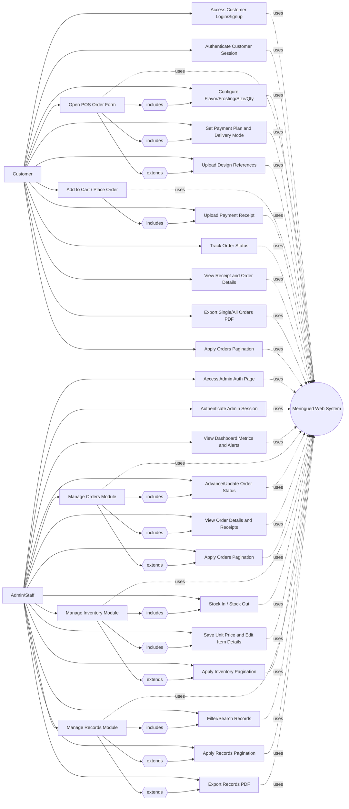

# Use Case Diagram (Aligned with Revised Events Table)

For the paper appendix, **`02-Use-Case-Diagram.docx`** embeds **ten** UML-style illustrations (six customer areas and four admin modules) generated under `assets/use-case-*.svg` by `scripts/build_use_case_diagram_docx.py`, aligned with sections A–G of the use case list and events table. **`04-Use-Case-Diagrams-Context.md`** provides the same figures in prose (primary and supporting use cases, dependencies, asset paths, and list/events cross-references). **`05-Use-Case-Descriptions.md`** adds SRS-style paragraph descriptions per module.

This revised diagram follows the same module flow used in the updated events table and use case list:
- Access/Auth
- Customer POS + Checkout
- Customer Tracking/Export
- Admin Orders
- Admin Inventory
- Admin Records
- Shared synchronization/validation

## Diagram Notes for Paper

- **Customer actor** covers authentication, POS configuration, checkout, receipt submission, tracking, and PDF export.
- **Admin/Staff actor** covers dashboard monitoring, order lifecycle control, inventory operations, records filtering, and document export (Word figures label this actor **Admin/Staff**; the Mermaid chart below uses the same label).
- **Pagination** is modeled explicitly as separate use cases for customer orders, admin orders, inventory, and records to reflect your updated UI behavior.
- **System node** represents shared services: role validation, data persistence, sync/merge logic, file validation, and export rendering.

